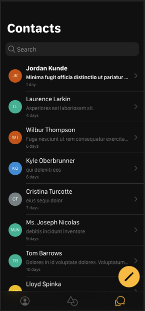

# Chatness Vue

Implementation in Ionic Vue using web components generated by [Chatness](https://chatness.app)

## Setup

- git clone
- npm install
- ionic serve

## Roadmap

- [x] contact list
- [ ] contact search
- [ ] message compose
- [ ] groups
- [ ] chat room
- [ ] profile
- [ ] settings
